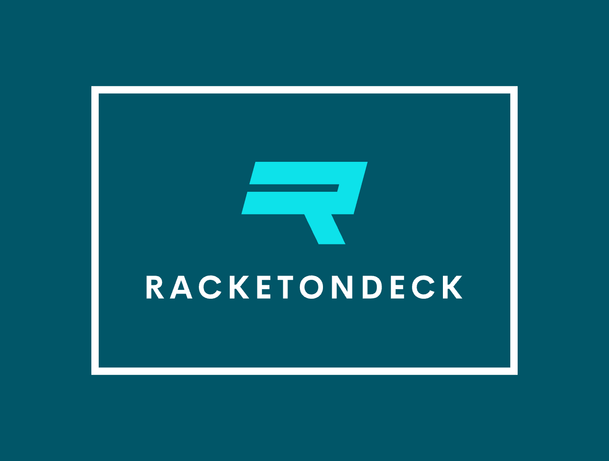

# **RacketOnDeck** 🎾🏓

### **The All-in-One Platform for Padel Academy Management**  

**RacketOnDeck** is a cutting-edge platform designed to simplify and elevate the management of padel and racket sports academies. From managing player profiles to organizing tournaments, scheduling courts, and streamlining communication, RacketOnDeck delivers a comprehensive suite of tools tailored to meet the needs of both small clubs and large academies.  

---

## 🌟 **Why Choose RacketOnDeck?**  

Managing a padel academy can be challenging. That’s where RacketOnDeck comes in:  
- **Save Time**: Automate repetitive tasks and focus on what matters most – growing your academy.  
- **Increase Engagement**: Build stronger connections with players, staff, and your community.  
- **Boost Efficiency**: Streamline every aspect of your operations from a single, user-friendly platform.  
- **Scale with Confidence**: Whether you’re running one court or a global network of academies, RacketOnDeck grows with you.  

---

## ✨ **Key Features**  

### **🎾 Player Management**  
- Create detailed player profiles to track progress, achievements, and performance.  
- Assign players to groups, coaches, and training sessions.  
- View schedules and attendance records with ease.  

### **📅 Court Reservations**  
- Real-time booking system with availability updates.  
- Manage recurring reservations for groups or individuals.  
- Reduce booking conflicts with smart scheduling.  

### **🏆 Tournament Management**  
- Effortlessly organize tournaments, from local competitions to large-scale events.  
- Automatic bracket generation and live updates for participants.  
- Track results and display rankings in real time.  

### **📊 Data & Insights**  
- Gain valuable insights into academy performance, player stats, and revenue streams.  
- Visualize trends to optimize operations and improve decision-making.  
- Export custom reports for staff, players, or sponsors.  

### **🔔 Notifications & Communication**  
- Send automated reminders for upcoming bookings, tournaments, or payments.  
- Enable instant messaging between players, coaches, and staff.  
- Keep everyone informed with academy-wide announcements.  

### **⚙️ Customization & Branding**  
- Fully customizable to reflect your academy’s branding.  
- Create a professional image with a polished, modern interface.  

---

## 🎯 **Who Can Benefit from RacketOnDeck?**  

### **For Academy Managers**  
- Oversee every aspect of operations with a bird’s-eye view.  
- Simplify administrative tasks and ensure smooth day-to-day management.  

### **For Players**  
- Book courts, join tournaments, and track personal progress effortlessly.  
- Stay updated with schedules and important notifications.  

### **For Coaches**  
- Organize training sessions and monitor player development.  
- Provide personalized feedback using player performance data.  

### **For Sponsors & Partners**  
- Showcase your academy’s professionalism with real-time stats and tournament highlights.  
- Attract sponsors with detailed analytics and audience engagement metrics.  

---

## 🌍 **Our Mission**  

At **RacketOnDeck**, we are passionate about revolutionizing the management of padel and racket sports academies. Our goal is to create a platform that not only simplifies operations but also fosters stronger connections between players, staff, and communities.  

We envision a world where technology empowers every academy to reach its full potential, making the sport more accessible and enjoyable for all.  

---

## 💡 **How Does RacketOnDeck Stand Out?**  

- **All-in-One Solution**: No need for multiple tools; everything is integrated.  
- **User-Friendly Design**: Built with simplicity and usability in mind.  
- **Scalable & Flexible**: Perfect for academies of any size or complexity.  
- **Community-Driven Innovation**: Constantly evolving based on user feedback.  

---

## 🌟 **Join the Revolution**  

With **RacketOnDeck**, managing your academy has never been easier. Whether you’re just starting out or managing a well-established institution, our platform is here to support your growth every step of the way.  

👉 **Get started today and experience the difference!**  
